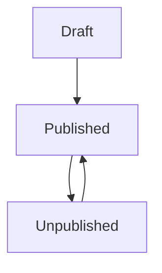

# Flux

[](LICENSE.md)
[]()
[](https://packagist.org/packages/ttensrl/flux)

Flux è un componente Bricks per la gestione degli stati del Flusso base per contenuti.  
Stati Flusso Base


## Installazione
``` bash
composer require ttensrl/flux
```

## Pubblicazione Asset
E Possibile pubblicare gli Asset **View**, Lang ed il file di configurazione utilizzando la sintassi classica del **comando artisan** `vendor:publish`
``` bash
php artisan vendor:publish  --provider="TtenSrl\Flux\FluxServiceProvider"
```
É inoltre possibile specificare un tag per selezionare il tipo di **asset** da publicare `--tag"Bricks-Flux-Translations"` per i file delle lingue, `--tag="Bricks-Flux-Config"` per i file di configurazione e `--tag="Bricks-Flux-View"` per le viste.
## Uso

### Modifiche del Database
É necessario che la **tabella** che ospita i contenuti da sottoporre al flusso base, contenga un **campo** utile per l'implementazione della gestione degli stati del flusso, solitamente questo campo si chiama `status`, aggiungere il campo alla vostra **migration**.
``` php
$table->string('status',32)->nullable();
```
Nel caso che, il nome del campo sia diverso da status, sarà necessario specificarlo nel file di configurazione `bricks-flux.php`
``` php
    /*
    |--------------------------------------------------------------------------
    | Nome del campo del database
    |--------------------------------------------------------------------------
    |
    | Qui è possibile specificare il nome del campo in cui vengono salvati gli stati
    |
    */
    'column' => 'status',
```

### Modifiche al Modello
Implementare **l'interfaccia** `Flowable` ed aggiungere il **Tratto** `HasEasyFlux` al **Modello**.
``` php
class Post extends Model implements Flowable
{
    use HasEasyFlux;
```
E possibile specificare il valore dello stato per i tre stati fondamentali del flusso base nel file di configurazione `bricks-flux.php`
``` php
    /*
    |--------------------------------------------------------------------------
    | Valori degli stati del flusso base
    |--------------------------------------------------------------------------
    |
    | Qui è possibile specificare per i tre stati fondamentali draft, published, unpublished
    | il valore da inserire all'interno del campo del database
    |
    */
    'status' => [
        'draft' => 'draft',
        'published' => 'published',
        'unpublished' => 'unpublished'
    ]
```
Quando viene creato un record, automaticamente viene aggiunto lo stato **draft**.

### Implementazione
ttensrl/Flux possiede due **implementazioni** preconfezionate per il cambio di stato, una è basata sui **component di laravel**, ed una è basata su **Livewire**.

#### Implementazione via Laravel Component
L'implementazione via **component** richiede di aggiungere un componente all'interno della **form** che gestisce la modifica, passando l'oggetto che implementa **l'interfaccia** Flowable.
``` php
    <x-flux-status :flowable="$post" />
```
Per il salvataggio è necessario aggiungere la **Facade** di salvataggio nel'update del **controller**.  
Utilizzare la **Facade** `Capacitor::fluxing(Flowable $object, String $status)`
``` php
    $post->title = $request->post('title');
    $post->body = $request->post('body');
    $post->save();
            
    Capacitor::fluxing($post, $request->post('status'));
```

#### Implementazione via Livewire
L'implementazione via **Livewire** richiede soltanto l'inserimento del tag fuori da una form, non è necessario aggiungere altro al **controller**.
``` php
    <livewire:flux-status :flowable="$post" />
```
### Scope
É possibile ottenere l'elenco **Eloquent** tramite filtri preimpostati grazie al **Tratto** `HasEasyFlux`  per i contenuti in Bozza, Pubblicati e non Pubblicati.

``` php
    $posts = Post::draft()->get(); //Ottiene tutti i contenuti nello stato bozza
    
    $posts = Post::published()->get(); //Ottiene tutti i contenuti nello stato Pubblicato
    
    $posts = Post::unPublished()->get(); //Ottiene tutti i contenuti nello stato Non Pubblicato
    
    $posts = Post::notPublished()->get(); //Ottiene tutti i contenuti negli stati diversi da pubblicato
```

### Salvataggio Stati
Se fosse necessario creare specifiche **implemetazioni** e si rendesse necessario salvare gli stati è possibile utilizzare i seguenti **metodi**.
``` php
    $post->title = $request->post('title');
    $post->body = $request->post('body');
    $post->save();
    
    $post->publish(); //Imposta lo stato su Pubblicato
    
    $post->unPublish(); //Imposta lo stato su non pubblicato
    
    $post->togglePublish(); //Imposta lo stato su pubblicato se lo stato è bozza o non pubblicato, e lo stato su non pubblicato se lo stato è pubblicato
```

### Accessors e Mutators
Il tratto `HasEasyFlux` aggiunge due **Accessors** e un **Mutator**, 
#### Accessor per la Traduzione
**L'accessor** per le lingue è invocabile tramite la **proprietà** `$post->trans_status`, questa rispondera con la traduzione dello stato nella lingua corrente.

#### Accessor e Mutator per l'astrazione del campo
Il **tratto** `HasEasyFlux` aggiunge un **mutator** ed un **accessor** per la **proprieta** `$post->status` questa **proprietà** funzionerà indipendentemente dal nome del campo nel database.


## Testing
Run the tests with:

``` bash
vendor/bin/phpunit
```

## Changelog
Please see [CHANGELOG](CHANGELOG.md) for more information what has changed recently.

## Contributing
Please see [CONTRIBUTING](CONTRIBUTING.md) for details.

## Credits

- [Stefano Pimpolari](https://www.ttemptation.it/gitlab/ttemptation/laravel-ttensrl/base-flux)
- [All Contributors](https://www.ttemptation.it/gitlab/ttemptation/laravel-ttensrl/base-flux/activity)

## Security
If you discover any security-related issues, please email stefano.pimpolari@tten.it instead of using the issue tracker.

## License
The MIT License (MIT). Please see [License File](/LICENSE.md) for more information.
